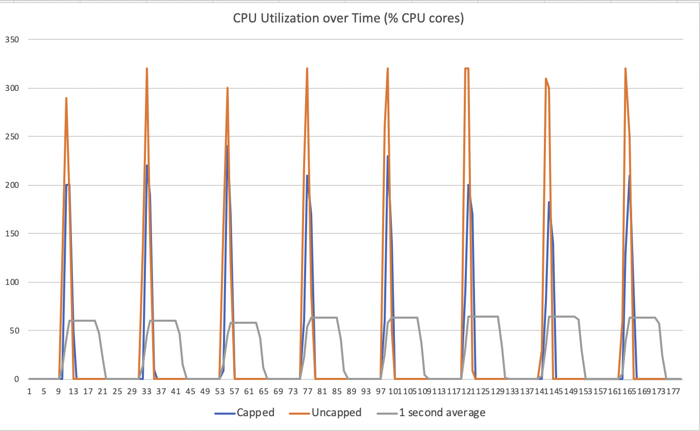

# Kubernetes Scheduling and Timescales

In our effort to optimize and understand better our platforms we had 
to enter the rabithole of understanding limits and resource allocations
in Kubernetes, containers, and cgroups. The results should have been
expected once all the details were understood, but neverthelles we 
believe that these details are missed by most operators. In this 
blog post we will attempt to clarify how one can actually estimate
the right resource allocations in a Kubernetes cluster. The goals
are to understand that timescales of CPU limiting and provide some
guidance on how to define these limits in application deployments.

## Kubernetes Resource Limits

Kubernetes (and containers more general) allow operators to place resource
limits while deploying workloads. We focus here on CPU allocations. There
are two part of any POD resource request:

1. CPU request, that defines the minimum possible CPU capacity that a POD
requires. This request is used by the Kubernetes scheduler when assigning
PODs to nodes with the goal that all such requests must be satisfied. In other
words, the sum of the CPU requests of all the PODs scheduled in a node must
not exceed the node capacity.

2. CPU limits identify the maximum resource allocation for a given POD, 
even when a node is otherwise unutilized. This is essentially a 
*hard* upper bound on the amount of CPU that is allocated to a POD.

Note, that requests alone cannot guarantee any isolation or quality of service
since individual PODs could be otherwise allowed to exceed their allocation
up to the node capacity. On the other hand limits, place a hard bound on
the CPU allocation of a POD, thus explicitly restricting the load it can
place on the system.

The important question though and probably the most critical parameter is 
over what time-scale is the average resource utilization calculated. During
the execution of an application its resource utilization fluctuates based on incoming
load, I/O operations etc. In the case of Kubernetes, this averaging interval
is configurable only through a kubelet parameter and it is 100ms (`--cpu-cfs-quota-period`). 
In other words if an application uses more CPU resources during a 100ms interval 
than what the limit defines the CPU allocation is throttled.

The operational problem that this introduces is how can one predict the right limit
for an application in a way that does not introduce artificial bottlenects. Especially
for highly multi-threaded or parallel applications, instantaneous load can fluctuate dramatically
over time, depending on the parallel invocation of threads.

### A Synthetic Benchmark 

In order to better illustrate the problems with the limit calculation
we wrote a small program that in a controlled way excersizes these limits.
(https://www.github.com/dstiliadis/sched-bench)
The program, written in Go, instantiates 4 parallel Go-routines that 
execute a CPU bound addition in a loop for 200ms and then sleep for 
2 seconds. We chose this synthetic benchmark in order to illustrate the problem.
We run the program in a simple Kubernetes cluster in GKE with n1-standard-4
VM instances (4 cores). Note, that the duration of the loop was selected 
as 200ms that is higher than the average interval used by
Kubelet.

Initially, we applied no resource limits in the program using a definition
like below:
```yaml
apiVersion: v1
kind: Pod
metadata:
  name: scheduler
spec:
  containers:
  - name: scheduler
    image: dimitrihub/scheduler
    resources:
      requests:
        memory: "64Mi"
        cpu: "250m"
```

During this execution, each of the Go-Routines would achieve approximately 1M during
the 200ms loop with a total "goodput" of 4M. 

We then modified the request and limited the CPU to 2 cores. Note, that this limit 
was selected on purpose since it is lower than the parellism level of the program
itself. The corresponding definition was:

```yaml 
apiVersion: v1
kind: Pod
metadata:
  name: scheduler
spec:
  containers:
  - name: scheduler
    image: dimitrihub/scheduler
    resources:
      requests:
        memory: "64Mi"
        cpu: "250m"
      limits:
        memory: "128Mi"
        cpu: "2000m"
```

The "goodput" of the program was immediately reduced by almost 50% and each
Go-routine was now cappated at about 500-600K iterations in 200ms. The total
goodput was reduced to approximately 2.3M. 

One would assume that this is a valid behavior. However, if we plot the 
CPU utilization of the program in 100ms intervals in both instances we can
see what is really happening. In the same plot, we also plot the average
CPU utilization of the program over 1 second intervals. The utilization
was derived in the nodes using:

```bash
top -b -n 1000 -d 0.1 -p 2053218 | grep scheduler
```



As it can be seen in the figure, the average utilization over 1 second
intervals when no caps or limits are applied is well below 1 core. However,
because the instantaneous CPU utilization over shorter timescales exceed
the limit, a cap singificantly deteriotes the performance.

## Know Your Limits

Unfortunately it is extremely hard for a software team to estimate the 
instantaneous limits of an application. Even though in the synthetic 
application we are able to explicitly determine the degree of parallelism
and active/sleeping timeframes in any common use it is not possible 
to estimate the effect of limits on the performance of applications. In 
some cases designers are able to estimate or predict long term averages
(over seconds), but are hardly able to predict short term spikes.

One has two choices in this case:

1. Launch applications without limits, actively monitor nodes and hope
that none of the microservices violates the behavior. Given that PODs
from multiple users and/or namespaces can scheduled in the same node
though provides very little comfort to operations teams on any CPU 
boundaries.

2. Correctly estimate the limits. We believe that in most cases
estimating parallelism at 100ms intervals (or for that matter any short
timeframe) will be very hard for any developer and in essense limits 
the statisticam multiplexing gains. If not all applications are bursting
at the same time, then CPU utilization will be low even though 
application performance can be significantly impacted.

Essentially we are seing the same performance tradeoffs that the networking
world has been studying for years and are now becoming even more critical
with Variable Bit Rate video traffic. Hard limits mean low CPU utilization
and a performance impact. No limits result in better CPU utilization
but uncontrolled behavior. 

As a first step, a better balance is to increase the time of averaging 
in your Kubernetes clusters since at least you can have a more predictable
performance boundary. Longer term, the CPU scheduling and cgroup limits 
need a lot of work to account for statistical multiplexing gains. 
