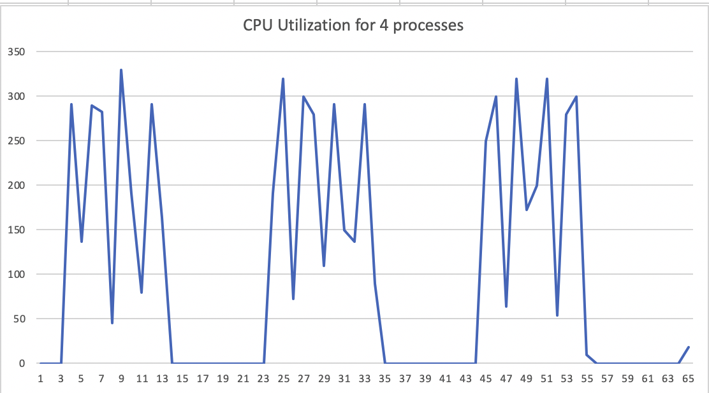

# Kubernetes Scheduling and Timescales

In our effort to optimize and understand better our platforms we had 
to enter the rabithole of understanding limits and resource allocations
in Kubernetes, containers, and cgroups. The results should have been
expected once all the details were understood, but neverthelles we 
believe that these details are missed by most operators. In this 
blog post we will attempt to clarify how one can actually estimate
the right resource allocations in a Kubernetes cluster. The goals
are to understand that timescales of CPU limiting and provide some
guidance on how to define these limits in application deployments.

The main conclusion that we will illustrate is that lack of controls on the timescales 
that CPU limits are enforced by the Linux/Kubernetes scheduler settings
can either lead to low CPU utilization or artifically constrain
applications performance. In order to properly set limits one has to 
understand the performance requirements in short timescales that is almost
impossible for any parallel or multi-threaded workload. At the same time
statistical multiplexing gain can be significantly limited and this can
result in significant under-utilization of CPU resources.

## Kubernetes Resource Limits

Kubernetes (and containers more general) allow operators to place resource
limits while deploying workloads. We focus here on CPU allocations. There
are two part of any POD resource request:

1. CPU request, that defines the minimum possible CPU capacity that a POD
requires. This request is used by the Kubernetes scheduler when assigning
PODs to nodes with the goal that all such requests must be satisfied. In other
words, the sum of the CPU requests of all the PODs scheduled in a node must
not exceed the node capacity.

2. CPU limits identify the maximum resource allocation for a given POD, 
even when a node is otherwise unutilized. This is essentially a 
*hard* upper bound on the amount of CPU that is allocated to a POD.

Note, that requests alone cannot guarantee any isolation or quality of service
since individual PODs could be otherwise allowed to exceed their allocation
up to the node capacity. On the other hand limits, place a hard bound on
the CPU allocation of a POD, thus explicitly restricting the load it can
place on the system.

The important question though and probably the most critical parameter is 
over what time-scale is the average resource utilization calculated. During
the execution of an application its resource utilization fluctuates based on incoming
load, I/O operations etc. In the case of Kubernetes, this averaging interval
is configurable only through a kubelet parameter and it is 100ms (`--cpu-cfs-quota-period`). 
In other words if an application uses more CPU resources during a 100ms interval 
than what the limit defines the CPU allocation is throttled.

The operational problem that this introduces is how can one predict the right limit
for an application in a way that does not introduce artificial bottlenects. Especially
for highly multi-threaded or parallel applications, instantaneous load can fluctuate dramatically
over time, depending on the parallel invocation of threads.

### A Synthetic Benchmark 

In order to better illustrate the problems with the limit calculation
we wrote a small program that in a controlled way excersizes these limits.
(https://www.github.com/dstiliadis/sched-bench)
The program, written in Go, instantiates 4 parallel Go-routines that 
execute a CPU bound addition in a loop for 200ms and then sleep for 
2 seconds. We chose this synthetic benchmark in order to illustrate the problem.
We run the program in a simple Kubernetes cluster in GKE with n1-standard-4
VM instances (4 cores). Note, that the duration of the loop was selected 
as 200ms that is higher than the average interval used by
Kubelet.

Initially, we applied no resource limits in the program using a definition
like below:
```yaml
apiVersion: v1
kind: Pod
metadata:
  name: scheduler
spec:
  containers:
  - name: scheduler
    image: dimitrihub/scheduler
    resources:
      requests:
        memory: "64Mi"
        cpu: "250m"
```

During this execution, each of the Go-Routines would achieve approximately 1M during
the 200ms loop with a total "goodput" of 4M. 

We then modified the request and limited the CPU to 2 cores. Note, that this limit 
was selected on purpose since it is lower than the parellism level of the program
itself. The corresponding definition was:

```yaml 
apiVersion: v1
kind: Pod
metadata:
  name: scheduler
spec:
  containers:
  - name: scheduler
    image: dimitrihub/scheduler
    resources:
      requests:
        memory: "64Mi"
        cpu: "250m"
      limits:
        memory: "128Mi"
        cpu: "2000m"
```

The "goodput" of the program was immediately reduced by almost 50% and each
Go-routine was now cappated at about 500-600K iterations in 200ms. The total
goodput was reduced to approximately 2.3M. 

One would assume that this is a valid behavior. However, if we plot the 
CPU utilization of the program in 100ms intervals in both instances we can
see what is really happening. In the same plot, we also plot the average
CPU utilization of the program over 1 second intervals. The utilization
was derived in the nodes using:

```bash
top -b -n 1000 -d 0.1 -p 2053218 | grep scheduler
```


As it can be seen in the figure, the average utilization over 1 second
intervals when no caps or limits are applied is well below 1 core. However,
because the instantaneous CPU utilization over shorter timescales exceed
the limit, a cap singificantly deteriotes the performance.

### Oversubscribing and Statistical Multiplexing

So far we were trying to estimate the CPU load by applying limits and 
we noticed that when we apply limits both CPU utilization and the 
actual work that our program was doing was reduced. In order to 
illustrate this point better, we now run four instances of our
program without any limits. This can be easily achieved by a deployment
file:

```yaml
apiVersion: apps/v1
kind: Deployment
metadata:
  name: scheduler
spec:
  replicas: 2
  selector:
    matchLabels:
      app: bench
  template:
    metadata:
      labels:
        app: bench
    spec:
      nodeSelector:
        target: enabled
      containers:
      - name: scheduler
        image: dimitrihub/scheduler
        resources:
          requests:
            memory: "64Mi"
            cpu: "250m"
```

Note, that because of the nodeSelector we make sure that all PODS are 
placed in the same node. If notice that logs of the PODS we will 
see that since there is no limit, the aggregate goodput of all PODs
is now at 16M. In other words, although we are running more processes
the CPU is better utilized and we can achieve better work. At the same
time, if we plot the aggregate CPU utilization of the node we notice 
that we have not exceeded the capacity of the node.



In other words, by not placing any limits we have achieved a higher
overall system utilization without any degradation in performance.

On the other hand, if we re-introduce the limits, the statistical 
multiplexing gain is removed, CPUs are idle and the programs take 
a longer time to complete. 

In other words, by artificially constraining the CPU allocation of a 
POD at small timescales we significantly limit the ability of the 
system to take advantage of statistical multiplexing gains. This limitation
leads to lower overall resource utilization that can translate to either 
higher costs or lower performance. Limits are useful only if we know
the right timescales to use.

## Performance of a Simple Web Server

We now extend the analylis with a simple Web application serving
API calls that one can argue represents a typical microservice.
For simplicity we assume that all API calls return immediately
and we do not account in the beginning for variable processing
times of API calls. We also create a simple client that issues
API calls following a Markov On-Off process. 

### Traffic Client


The traffic client simulates a number of independent Markov-modulated
on/off processes in an attempt to simulate a real world environment.
Each client starts from the ON stat and makes API requests as fast
it can. The time in the ON state is determined through an exponential
distribution. After the client is complete, it enters the OFF 
state for an exponentially averaged time, where it remains idle.
We super-impose multiple of these processes in order to create a 
realistic arrival traffic. 

## Performance Analysis

In order to demonstrate the effects of cPU limiting we deploy the 
client and server in different nodes of a Kubernetes cluster 
using 8-core machines in GCP. Initially we deploy the server
without limits and then we introduce limits of 2, 3, and 4 cores.

We chose the arrival rate so that in the average (over 5 seconds
intervals) an unrestricted server will have a utilization of 
less than 180% (and essentially less than 2 cores). We then supply
traffic and measure the average CPU utilization, the rate of API
calls/second served as well as the average latency of the API calls.
The arrival traffic uses 64 independent clients.
The server CPU utilization where there are no limits and over
different time-scales is illustrated in the figure below:


As it can be noticed in the un-constrained case the CPU utilization
over longer time-scales is below 2 cores, although the 100ms CPU 
utilization can reach a maximum of 3 cores. The instantaneous utilization
obviously depends on the number of conncurent active clients and
their on/off state.

We then repeat the same experiment by limiting the CPU utilization
through the Kubernetes limit parameters to 2, 3, and four cores.
The aggregate results are shown in the table below:

| Metric  | Unlimited | 2-cores  | 3-cores | 4-cores |
| --- | --- | --- | --- |--- |
| API calls /second | 22969 | 21563 | 22000 | 22500 |
| Average Latency   | 14.3us | 30.67us |  16.2us| 16.1us| 

As we can see from the above results, given our traffic patterns restricting the cores to two reduced the API rate by 5%, but most significantly increased the average latency by 100%. Essentially our clients were observing double the latencies for executing the APIs. 

### Multi-hop Impacts

Note that in a micro-service environment where processing a user request might involve the execution of several micro-services potentially in a series of calls the above variations can have dramatic results. It is not only that the latency of a server is increased, but clients will also notice additive latencies and potentially slower CPU utilization. The multi-hop impact requires additional data that we will provide in a subsequent blog post.


## Know Your Limits

Unfortunately it is extremely hard for a software team to estimate the 
instantaneous limits of an application. In several instances engineering
teams might calculated longer term averages given specific test workloads,
but they will often not match those with the scheduling time-scales. 
Even though in the synthetic application we are able to explicitly determine the degree of parallelism
and active/sleeping timeframes in any common use it is not possible 
to estimate the effect of limits on the performance of applications. 

One has a couple of choices on properly setting limits:

1. Launch applications without limits, actively monitor nodes and hope
that none of the microservices violates the behavior. Given that PODs
from multiple users and/or namespaces can scheduled in the same node
though, this approach provides very little comfort to operations teams on any CPU 
boundaries. More importantly in any soft multi-tenant environment 
developers will not be able to see the complete effects on applications
since nodes are shared by several users.

2. Correctly estimate the limits. We believe that in most cases
estimating parallelism at 100ms intervals (or for that matter any short
timeframe) will be very hard for any application and in essense limits 
the statisticam multiplexing gains. In most scenarios not all micro-services
are bursting in terms of CPU utilization at the same time and taking
advantage of statistical multiplexing gains is critical to maintain
a relatively high overall node utilization.

3. Explicitly control paralellism of applications so that any limits 
in Kubernetes match an expected behavior. In this case an applicaiton
is tested with specific parallelism limits (as an example by limiting
COMAXPROCS in Go) and in this case the Kubernetes deployment will match
the limits of the application. When this approach is chosen, performance is predictable,
but the statistical multiplexing gains are also limited, and therefore
overall CPU utilization will be limited as well.

Essentially we are seing the same performance tradeoffs that the networking
world has been studying for years. Hard limits mean low CPU utilization
and potentially longer latencies for bursty applications. No limits result in 
better CPU utilization but uncontrolled behavior and no separation between
applications.

As a first step, a better balance is to increase the time of averaging 
in your Kubernetes clusters since at least you can have a more predictable
performance boundary. Longer term, the CPU scheduling and cgroup limits 
need a lot of work to account for statistical multiplexing gains. 

